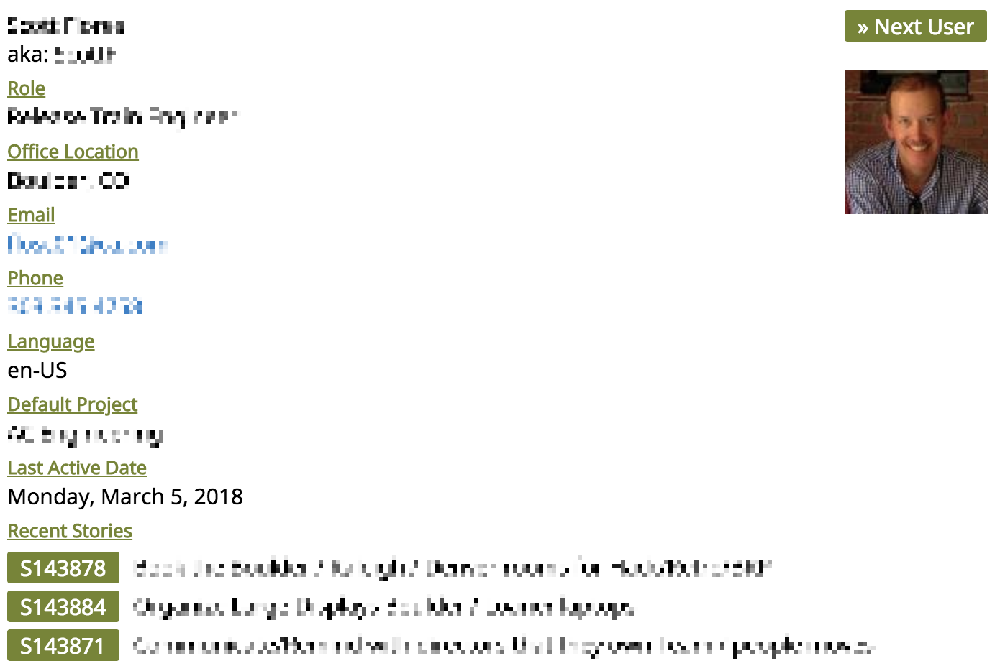
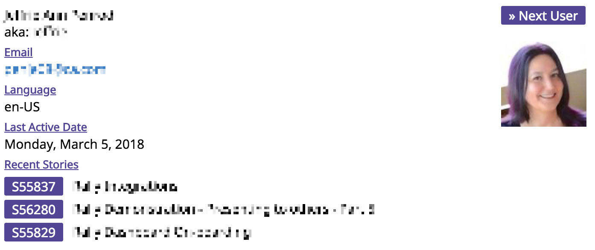

CAAC-Roulette
=========================

## Overview

Welcome serendipity into your life with CA Agile Central (CAAC) Roulette! This app presents a random user with profile details and their recent work:

Some users have more or less profile information in Agile Central, so the app will adjust what is shown:

## Why Play Roulette?

This app is a multi-purpose tool that can help you get connected with fellow Agile Central users without bias. Naturally, we want to talk more with people who are similar to us or sit near us. With this app everyone in your subscriptions is given a random chance to be picked. With this, you could:
* As a Executive/Leader, connect with contributors to ensure their aligned on your vision, motivated, and have a chance to ask you questions
* As a DevOps Product Owner (like me!), connect with developers in your organization to perform empathy interviews and get feedback on the value you deliver
* As a Subscription Admin, connect with Agile Central users to understand the health of your implementation and discover ways to improve

This app was inspired by an [Invisibilia podcast episode](https://www.npr.org/sections/alltechconsidered/2017/06/08/531796329/eager-to-burst-his-own-bubble-a-techie-made-apps-to-randomize-his-life) on bubble bursting, where an app encourages people to leave their comfort zone to explore the perspectives of others.